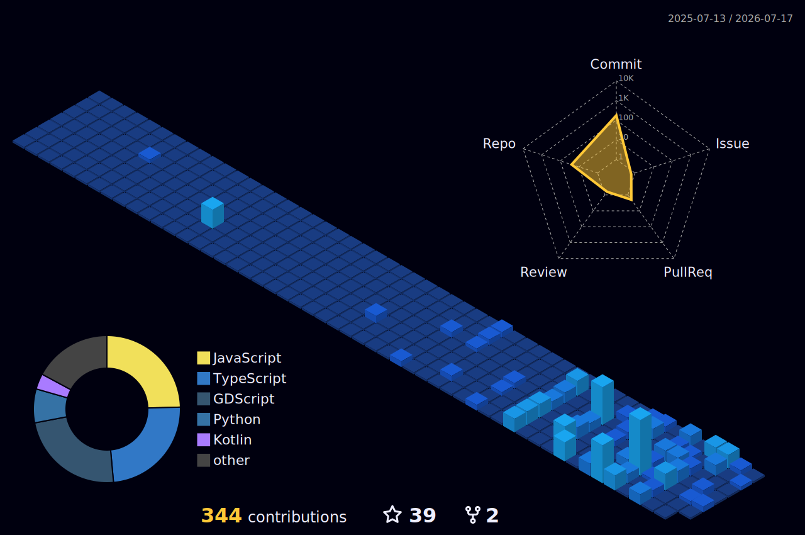

<!-- Epic Cyberpunk / Hacker GIF Banner (Reduced Size) -->

<!-- Unique Gamer Name Plate (Using Orbitron Sci-Fi Font) -->
<h1>
  
</h1>

<!-- Player Stats (Views, Level, Status) -->

  
  
  

<!-- Weapon of Choice (Massive Skills List) -->
<h2> WEAPONS OF CHOICE</h2>

  ** Programming Languages** 
  
  
  
  
  
    
  ** Frameworks & Engines** 
  
  
  
  
  

<h2>🎮 LIVE SERVERS (Play Now!)</h2>

  
  
  &nbsp;&nbsp;
  

<h2>🏆 PLAYER PROGRESSION</h2>

  <!-- GitHub Stats Fixed (Removed private commit tracking to fix broken image) -->
  
  
  

<h2>🏙️ 3D CONTRIBUTION CITY</h2>

  <!-- Auto-generated by GitHub Actions (Will appear once action runs) -->
  

<h2>🔥 COMBAT RECORD (Contributions)</h2>

  <!-- Activity Graph in Dark Theme -->
  

  

---
 

  

